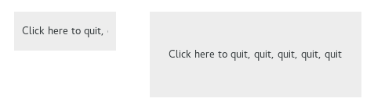

  GTK+ 2.0 Tutorial using Ocaml
  ------------------------------- -- ---------------------------
  [\<\<\< Previous](x1415.html)      [Next \>\>\>](x1455.html)

* * * * *

Container Widgets
=================

The EventBox {.SECT1}
============

Some GTK widgets don't have associated X windows, so they just draw on
their parents. Because of this, they cannot receive events and if they
are incorrectly sized, they don't clip so you can get messy overwriting,
etc. If you require more from these widgets, the EventBox is for you.

At first glance, the EventBox widget might appear to be totally useless.
It draws nothing on the screen and responds to no events. However, it
does serve a function - it provides an X window for its child widget.
This is important as many GTK widgets do not have an associated X
window. Not having an X window saves memory and improves performance,
but also has some drawbacks. A widget without an X window cannot receive
events, and does not perform any clipping on its contents. Although the
name *EventBox* emphasizes the event-handling function, the widget can
also be used for clipping. (and more, see the example below).

To create a new EventBox widget, use
[`GBin.event_box`{.LITERAL}](http://lablgtk.forge.ocamlcore.org/refdoc/GBin.html#VALevent_box):

~~~~ {.PROGRAMLISTING}
val GBin.event_box :
    ?border_width:int ->
    ?width:int ->
    ?height:int ->
    ?packing:(GObj.widget -> unit) ->
    ?show:bool -> unit -> event_box
~~~~

A child widget can then be added to this EventBox:

~~~~ {.PROGRAMLISTING}
method add : GObj.widget -> unit
~~~~

The following example demonstrates both uses of an EventBox - a label is
created that is clipped to a small box, and set up so that a mouse-click
on the label causes the program to exit. Resizing the window reveals
varying amounts of the label.

~~~~ {.PROGRAMLISTING}
(* file: event_box.ml *)

let main () =
  (* Create a new window; set title and border width *)
  let window = GWindow.window ~title:"Event Box" ~border_width:10 () in

  (* Set a handler for destroy event that immediately exits GTK. *)
  window#connect#destroy ~callback:GMain.Main.quit;

  (* Create an EventBox and add it to our toplevel window *)
  let event_box = GBin.event_box ~packing:window#add () in

  (* Create a long label *)
  let label = GMisc.label ~text:"Click here to quit, quit, quit, quit, quit"
    ~packing:event_box#add ()
  in

  (* Clip it short. *)
  label#misc#set_size_request ~width:110 ~height:20;

  (* And bind an action to it *)
  event_box#event#add [`BUTTON_PRESS];
  event_box#event#connect#button_press ~callback:(fun ev -> exit 0; true);

  (* Yet one more thing you need an X window for ... *)
  event_box#misc#realize ();
  Gdk.Window.set_cursor event_box#misc#window (Gdk.Cursor.create `HAND1);

  window#show ();
  GMain.Main.main ()

let _ = Printexc.print main ()
~~~~

* * * * *

  ------------------------------- -------------------- ---------------------------
  [\<\<\< Previous](x1415.html)   [Home](book1.html)   [Next \>\>\>](x1455.html)
  File Selections                                      The Alignment widget
  ------------------------------- -------------------- ---------------------------

