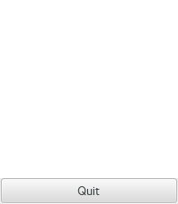

  GTK+ 2.0 Tutorial using Ocaml
  ------------------------------- -- ---------------------------
  [\<\<\< Previous](x2193.html)      [Next \>\>\>](x2205.html)

* * * * *

Scribble, A Simple Example Drawing Program
==========================================

Overview {.SECT1}
========

In this section, we will build a simple drawing program. In the process,
we will examine how to handle mouse events, how to draw in a window, and
how to do drawing better by using a backing pixmap. After creating the
simple drawing program, we will extend it by adding support for XInput
devices, such as drawing tablets. GTK provides support routines which
makes getting extended information, such as pressure and tilt, from such
devices quite easy.

* * * * *

  ------------------------------- -------------------- ---------------------------
  [\<\<\< Previous](x2193.html)   [Home](book1.html)   [Next \>\>\>](x2205.html)
  Example rc file                                      Event Handling
  ------------------------------- -------------------- ---------------------------

