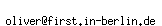

  GTK+ 2.0 Tutorial using Ocaml
  ------------------------------- -- ---------------------------
  [\<\<\< Previous](x2247.html)      [Next \>\>\>](c2308.html)

* * * * *

Contributing
============

This document, like so much other great software out there, was created
for free by volunteers. If you are at all knowledgeable about any aspect
of GTK that does not already have documentation, please consider
contributing to this document.

If you do decide to contribute, please contact via the Gtk+
developer-pages:
[https://www.gnome.org/contact/](https://www.gnome.org/contact/). Also,
be aware that the entirety of this document is free, and any addition by
you provide must also be free. That is, people may use any portion of
your examples in their programs, and copies of this document may be
distributed at will, etc.

Thank you.

Ocaml Version Contributing {.SECT1}
==========================

This document, like so much other great software out there, was created
for free by volunteers. If you are at all knowledgeable about any aspect
of GTK that does not already have documentation, please consider
contributing to this document.

If you do decide to contribute, please do it via GitHub:
[https://github.com/klartext/lablgtk2-ocaml-Tutorial](https://github.com/klartext/lablgtk2-ocaml-Tutorial).
You can also send me email:  Also, be
aware that the entirety of this document is free, and any addition by
you provide must also be free. That is, people may use any portion of
your examples in their programs, and copies of this document may be
distributed at will, etc.

Thank you.

* * * * *

  ------------------------------------- -------------------- ---------------------------
  [\<\<\< Previous](x2247.html)         [Home](book1.html)   [Next \>\>\>](c2308.html)
  The DrawingArea Widget, And Drawing                        Credits
  ------------------------------------- -------------------- ---------------------------

