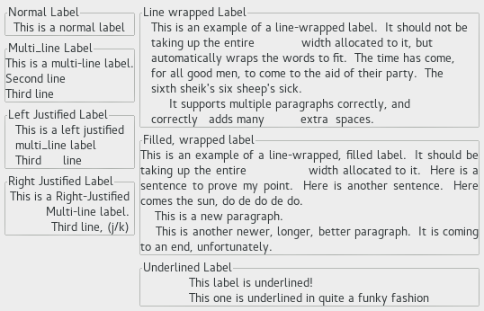

  GTK+ 2.0 Tutorial using Ocaml
  ------------------------------- -- --------------------------
  [\<\<\< Previous](x944.html)       [Next \>\>\>](x997.html)

* * * * *

Miscellaneous Widgets
=====================

Labels {.SECT1}
======

Labels are used a lot in GTK, and are relatively simple. Labels emit no
signals as they do not have an associated X window. If you need to catch
signals, or do clipping, place it inside a
[EventBox](c1436.html#SEC-EVENTBOX) widget or a Button widget.

To create a new label, use
[`GMisc.label`{.LITERAL}](http://lablgtk.forge.ocamlcore.org/refdoc/GMisc.html#VALlabel):

~~~~ {.PROGRAMLISTING}
val GMisc.label : ?text:string ->
    ?markup:string ->
    ?use_underline:bool ->
    ?mnemonic_widget:#GObj.widget ->
    ?justify:Gtk.Tags.justification ->
    ?line_wrap:bool ->
    ?pattern:string ->
    ?selectable:bool ->
    ?xalign:float ->
    ?yalign:float ->
    ?xpad:int ->
    ?ypad:int ->
    ?width:int ->
    ?height:int ->
    ?packing:(GObj.widget -> unit) ->
    ?show:bool ->
    unit -> label

markup : overrides text if both are present
use_underline : default value is false
justify : default value is `LEFT
line_wrap : default values is false
selectable : default value is false
~~~~

To change the label's text after creation, use the function
[`GMisc.label#set_text`{.LITERAL}](http://lablgtk.forge.ocamlcore.org/refdoc/GMisc.label_skel-c.html#METHODset_text):

~~~~ {.PROGRAMLISTING}
method set_text : string -> unit
~~~~

The space needed for the new string will be automatically adjusted if
needed. You can produce multi-line labels by putting line breaks in the
label string.

To retrieve the current string, use
[`GMisc.label#text`{.LITERAL}](http://lablgtk.forge.ocamlcore.org/refdoc/GMisc.label_skel-c.html#METHODtext):

~~~~ {.PROGRAMLISTING}
method text : string
~~~~

The label text can be justified using
[`GMisc.label#set_justify`{.LITERAL}](http://lablgtk.forge.ocamlcore.org/refdoc/GMisc.label_skel-c.html#METHODset_justify):

~~~~ {.PROGRAMLISTING}
method set_justify : Gtk.Tags.justification -> unit
~~~~

Values for `Gtk.Tags.justification`{.LITERAL} are:

~~~~ {.PROGRAMLISTING}
  `LEFT
  `RIGHT
  `CENTER (the default)
  `FILL
~~~~

The label widget is also capable of line wrapping the text
automatically. This can be activated using
[`GMisc.label#set_line_wrap`{.LITERAL}](http://lablgtk.forge.ocamlcore.org/refdoc/GMisc.label_skel-c.html#METHODset_line_wrap):

~~~~ {.PROGRAMLISTING}
method set_line_wrap : bool -> unit
~~~~

If you want your label underlined, then you can set a pattern on the
label
[`GMisc.label#set_pattern`{.LITERAL}](http://lablgtk.forge.ocamlcore.org/refdoc/GMisc.label_skel-c.html#METHODset_pattern):

~~~~ {.PROGRAMLISTING}
method set_pattern : string -> unit
~~~~

The pattern argument indicates how the underlining should look. It
consists of a string of underscore and space characters. An underscore
indicates that the corresponding character in the label should be
underlined. For example, the string `"__     __"`{.LITERAL} would
underline the first two characters and eight and ninth characters.

Below is a short example to illustrate these functions. This example
makes use of the Frame widget to better demonstrate the label styles.
You can ignore this for now as the [Frame](x1510.html) widget is
explained later on.

In GTK+ 2.0, label texts can contain markup for font and other text
attribute changes, and labels may be selectable (for copy-and-paste).
These advanced features won't be explained here.

~~~~ {.PROGRAMLISTING}
(* file: label.ml *)

let main () =
  let window = GWindow.window ~title:"Labels" ~border_width:5 () in
  window #connect#destroy ~callback:GMain.Main.quit;

  let hbox = GPack.hbox ~spacing:5 ~packing:window#add () in
  let vbox = GPack.vbox ~spacing:5 ~packing:hbox#add () in

  let frame = GBin.frame ~label:"Normal Label" ~packing:vbox#pack () in
  GMisc.label ~text:"This is a normal label" ~packing:frame#add ();

  let frame = GBin.frame ~label:"Multi_line Label" ~packing:vbox#pack () in
  GMisc.label
    ~text:"This is a multi-line label.\nSecond line\nThird line"
    ~packing:frame#add ();

  let frame = GBin.frame ~label:"Left Justified Label" ~packing:vbox#pack () in
  GMisc.label
    ~text:"This is a left justified\nmulti_line label\nThird      line"
    ~justify:`LEFT ~packing:frame#add ();

  let frame = GBin.frame ~label:"Right Justified Label" ~packing:vbox#pack () in
  GMisc.label
    ~text:"This is a Right-Justified\nMulti-line label.\nThird line, (j/k)"
    ~justify:`RIGHT ~packing:frame#add ();

  let vbox = GPack.vbox ~spacing:5 ~packing:hbox#add () in

  let frame = GBin.frame ~label:"Line wrapped Label" ~packing:vbox#pack () in
  GMisc.label
    ~text:"This is an example of a line-wrapped label.  It should not be taking up the entire             width allocated to it, but automatically wraps the words to fit.  The time has come, for all good men, to come to the aid of their party.  The sixth sheik's six sheep's sick.
     It supports multiple paragraphs correctly, and  correctly   adds many          extra  spaces. "
    ~packing:frame#add ~line_wrap:true ();

  let frame = GBin.frame ~label:"Filled, wrapped label" ~packing:vbox#pack () in
  GMisc.label
    ~text:"This is an example of a line-wrapped, filled label.  It should be taking up the entire              width allocated to it.  Here is a sentence to prove my point.  Here is another sentence.  Here comes the sun, do de do de do.
    This is a new paragraph.
    This is another newer, longer, better paragraph.  It is coming to an end, unfortunately."
    ~line_wrap:true ~justify:`FILL ~packing:frame#add ();

  let frame = GBin.frame ~label:"Underlined Label" ~packing:vbox#pack () in
  GMisc.label
    ~text:"This label is underlined!\nThis one is underlined in quite a funky fashion"
    ~pattern:"_________________________ _ _________ _ ______     __ _______ ___"
    ~justify:`LEFT ~packing:frame#add ();

  window #show ();
  GMain.Main.main ()

let _ = Printexc.print main ()
~~~~

* * * * *

  ------------------------------ -------------------- --------------------------
  [\<\<\< Previous](x944.html)   [Home](book1.html)   [Next \>\>\>](x997.html)
  Example                                             Arrows
  ------------------------------ -------------------- --------------------------

