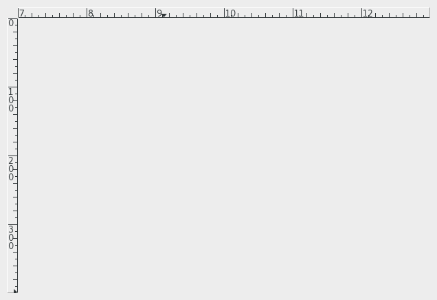

  GTK+ 2.0 Tutorial using Ocaml
  ------------------------------- ----------------------- ---------------------------
  [\<\<\< Previous](x1071.html)   Miscellaneous Widgets   [Next \>\>\>](x1135.html)

* * * * *

Rulers {.SECT1}
======

Ruler widgets are used to indicate the location of the mouse pointer in
a given window. A window can have a vertical ruler spanning across the
width and a horizontal ruler spanning down the height. A small
triangular indicator on the ruler shows the exact location of the
pointer relative to the ruler.

A ruler must first be created. Horizontal and vertical rulers are
created using
[`GRange.ruler`{.LITERAL}](http://lablgtk.forge.ocamlcore.org/refdoc/GRange.html#VALruler)

~~~~ {.PROGRAMLISTING}
val GRange.ruler:
    Gtk.Tags.orientation ->
    ?metric:Gtk.Tags.metric_type ->
    ?lower:float ->
    ?upper:float ->
    ?max_size:float ->
    ?position:float ->
    ?packing:(GObj.widget -> unit) ->
    ?show:bool -> unit -> ruler

metric : default value is `PIXELS
~~~~

Orientation should be given as an argument. It can be
`` `HORIZONTAL ``{.LITERAL} for horizontal ruler and
`` `VERTICAL ``{.LITERAL} for vertical ruler.

Units of measure for rulers can be`` `PIXELS ``{.LITERAL},
`` `INCHES ``{.LITERAL} or `` `CENTIMETERS ``{.LITERAL}. This can be set
using

~~~~ {.PROGRAMLISTING}
method set_metric : Gtk.Tags.metric_type -> unit
~~~~

The default measure is `` `PIXELS ``{.LITERAL}.

Other important characteristics of a ruler are how to mark the units of
scale and where the position indicator is initially placed. These are
set for a ruler using

~~~~ {.PROGRAMLISTING}
method set_lower : float -> unit
method set_upper : float -> unit
method set_position : float -> unit
method set_max_size : float -> unit
~~~~

The lower and upper define the extent of the ruler, and max\_size is the
largest possible number that will be displayed. Position defines the
initial position of the pointer indicator within the ruler.

A vertical ruler can span an 800 pixel wide window thus

~~~~ {.PROGRAMLISTING}
vruler#set_lower 0;
vruler#set_upper 800;
vruler#set_position 0;
vruler#set_max_size 800;
~~~~

The markings displayed on the ruler will be from 0 to 800, with a number
for every 100 pixels. If instead we wanted the ruler to range from 7 to
16, we would code

~~~~ {.PROGRAMLISTING}
vruler#set_lower 7;
vruler#set_upper 16;
vruler#set_position 0;
vruler#set_max_size 20;
~~~~

The indicator on the ruler is a small triangular mark that indicates the
position of the pointer relative to the ruler. If the ruler is used to
follow the mouse pointer, the motion\_notify\_event signal should be
connected to the motion\_notify\_event method of the ruler. To follow
all mouse movements within a window area, we would use

~~~~ {.PROGRAMLISTING}
area#event#connect#motion_notify ~callback:(fun ev -> hruler#event#send (ev :> GdkEvent.any));
~~~~

The following example creates a drawing area with a horizontal ruler
above it and a vertical ruler to the left of it. The size of the drawing
area is 600 pixels wide by 400 pixels high. The horizontal ruler spans
from 7 to 13 with a mark every 100 pixels, while the vertical ruler
spans from 0 to 400 with a mark every 100 pixels. Placement of the
drawing area and the rulers is done using a table.

~~~~ {.PROGRAMLISTING}
(* file: ruler.ml *)

let xsize = 600
let ysize = 400

let main () =
  let window = GWindow.window ~title:"Ruler" ~border_width:10 () in
  window#connect#destroy ~callback:GMain.Main.quit;

  (* Create a table for placing the ruler and the drawing area *)
  let table = GPack.table ~rows:3 ~columns:2 ~packing:window#add () in

  let area = GMisc.drawing_area ~width:xsize ~height:ysize
    ~packing:(table#attach ~left:1 ~top:1) () in
  area#event#add [`POINTER_MOTION; `POINTER_MOTION_HINT];

  (* The horizontal ruler goes on the top. As the mouse moves across
   * the drawing area, a motion_notify_event is passed to the
   * approprite event handler for the ruler. *)
  let hruler = GRange.ruler `HORIZONTAL ~metric:`PIXELS
    ~lower:7.0 ~upper:13.0 ~position:0.0 ~max_size:20.0
    ~packing:(table#attach ~left:1 ~top:0) () in
  area#event#connect#motion_notify
    ~callback:(fun ev -> hruler#event#send (ev :> GdkEvent.any));

  (* The vertical ruler goes on the left. As the mouse moves across
   * the drawing area, a motion_notify_event is passed to the
   * approprite event handler for the ruler. *)
  let vruler = GRange.ruler `VERTICAL ~metric:`PIXELS
    ~lower:0.0 ~upper:(float ysize) ~position:0.0 ~max_size:(float ysize)
    ~packing:(table#attach ~left:0 ~top:1) () in
  area#event#connect#motion_notify
    ~callback:(fun ev -> vruler#event#send (ev :> GdkEvent.any));

  window#show ();
  GMain.Main.main ()

let _ = main ()
~~~~

* * * * *

  ------------------------------- -------------------- ---------------------------
  [\<\<\< Previous](x1071.html)   [Home](book1.html)   [Next \>\>\>](x1135.html)
  Dialogs                         [Up](c953.html)      Statusbars
  ------------------------------- -------------------- ---------------------------

