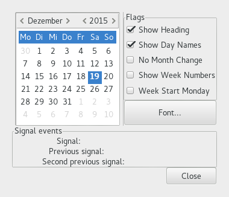

  GTK+ 2.0 Tutorial using Ocaml
  ------------------------------- ----------------------- ---------------------------
  [\<\<\< Previous](x1278.html)   Miscellaneous Widgets   [Next \>\>\>](x1390.html)

* * * * *

Calendar {.SECT1}
========

The Calendar widget is an effective way to display and retrieve monthly
date related information. It is a very simple widget to create and work
with.

Creating a GtkCalendar widget is a simple as: (see
[`GMisc.calendar`{.LITERAL}](http://lablgtk.forge.ocamlcore.org/refdoc/GMisc.html#VALcalendar))

~~~~ {.PROGRAMLISTING}
val GMisc.calendar :
    ?options:Gtk.Tags.calendar_display_options list ->
    ?packing:(GObj.widget -> unit) ->
    ?show:bool -> unit -> calendar
~~~~

There might be times where you need to change a lot of information
within this widget and the following functions allow you to make
multiple change to a Calendar widget without the user seeing multiple
on-screen updates.

~~~~ {.PROGRAMLISTING}
method freeze : unit -> unit
method thaw : unit -> unit
~~~~

They work just like the freeze/thaw functions of every other widget.

The Calendar widget has a few options that allow you to change the way
the widget both looks and operates by using the function

~~~~ {.PROGRAMLISTING}
method display_options : Gtk.Tags.calendar_display_options list -> unit
~~~~

The `flags`{.LITERAL} argument can be formed by combining either of the
following five options:

`` `SHOW_HEADING ``{.LITERAL}
:   this option specifies that the month and year should be shown when
    drawing the calendar.

`` `SHOW_DAY_NAMES ``{.LITERAL}
:   this option specifies that the three letter descriptions should be
    displayed for each day (eg Mon,Tue, etc.).

`` `NO_MONTH_CHANGE ``{.LITERAL}
:   this option states that the user should not and can not change the
    currently displayed month. This can be good if you only need to
    display a particular month such as if you are displaying 12 calendar
    widgets for every month in a particular year.

`` `SHOW_WEEK_NUMBERS ``{.LITERAL}
:   this option specifies that the number for each week should be
    displayed down the left side of the calendar. (eg. Jan 1 = Week
    1,Dec 31 = Week 52).

`` `WEEK_START_MONDAY ``{.LITERAL}
:   this option states that the calander week will start on Monday
    instead of Sunday which is the default. This only affects the order
    in which days are displayed from left to right.

The following functions are used to set the the currently displayed
date:

~~~~ {.PROGRAMLISTING}
method select_month : month:int -> year:int -> unit
method select_day : int -> unit
~~~~

With `select_day()`{.LITERAL} the specified day number is selected
within the current month, if that is possible. A `day`{.LITERAL} value
of 0 will deselect any current selection.

In addition to having a day selected, any number of days in the month
may be "marked". A marked day is highlighted within the calendar
display. The following functions are provided to manipulate marked days:

~~~~ {.PROGRAMLISTING}
method mark_day : int -> unit
method unmark_day : int -> unit
method clear_marks : unit
~~~~

For example:

~~~~ {.PROGRAMLISTING}
let calendar = GMisc.calendar in

...

(* Is day 7 marked? *)
if calendar#mark_day 7 then (
    (* day is marked *)
) else (
    ...
)
~~~~

Note that marks are persistent across month and year changes.

The final Calendar widget function is used to retrieve the currently
selected date, month and/or year.

~~~~ {.PROGRAMLISTING}
method date : int * int * int
~~~~

The Calendar widget can generate a number of signals indicating date
selection and change. The names of these signals are self explanatory,
and are; see
[`GMisc.calendar_signals`{.LITERAL}](http://lablgtk.forge.ocamlcore.org/refdoc/GMisc.calendar_signals-c.html):

-   `month_changed`{.LITERAL}

-   `day_selected`{.LITERAL}

-   `day_selected_double_click`{.LITERAL}

-   `prev_month`{.LITERAL}

-   `next_month`{.LITERAL}

-   `prev_year`{.LITERAL}

-   `next_year`{.LITERAL}

That just leaves us with the need to put all of this together into
example code.

~~~~ {.PROGRAMLISTING}
(* file: calendar.ml *)

type signals =
  { mutable last_sig: GMisc.label;
    mutable prev_sig: GMisc.label;
    mutable prev2_sig: GMisc.label
  }

let signals =
  let label = GMisc.label () in
  { last_sig = label;
    prev_sig = label;
    prev2_sig = label }

let set_signal_strings string =
  signals.prev2_sig#set_text signals.prev_sig#text;
  signals.prev_sig#set_text signals.last_sig#text;
  signals.last_sig#set_text string

let show_signal calendar msg () =
  let (y, m, d) = calendar#date in
  let str = Printf.sprintf "%s: %d/%d/%d" msg y m d in
  set_signal_strings str

let toggle_flags calendar but_flags () =
  let rec loop bflags =
    match bflags with
    | [] -> []
    | (but, flag)::rest ->
      if but#active
      then flag :: loop rest
      else loop rest
  in
  let flags = loop but_flags in
  calendar#display_options flags

let font_selection_ok font_window calendar () =
  let font_name = font_window#selection#font_name in
  let font_desc = GPango.font_description font_name in
  calendar#misc#modify_font font_desc

let select_font calendar () =
  let fwin = GWindow.font_selection_dialog ~title:"Font Selection Dialog" ~modal:true ~position:`MOUSE () in
  fwin#connect#destroy ~callback:fwin#destroy;
  fwin#ok_button#connect#clicked ~callback:(font_selection_ok fwin calendar);
  fwin#cancel_button#connect#clicked ~callback:fwin#destroy;
  fwin#show ()

let flags = [("Show Heading", true, `SHOW_HEADING);
    ("Show Day Names", true, `SHOW_DAY_NAMES);
    ("No Month Change", false, `NO_MONTH_CHANGE);
    ("Show Week Numbers", false, `SHOW_WEEK_NUMBERS);
    ("Week Start Monday", false, `WEEK_START_MONDAY)]

let create_calendar () =
  (* Create a new window; set title and border width *)
  let window = GWindow.window ~title:"Calendar Example" ~resizable:false ~border_width:10 () in

  (* Set a handler for destroy event that immediately exits GTK. *)
  window#connect#destroy ~callback:GMain.Main.quit;

  let vbox = GPack.vbox ~border_width:10 ~packing:window#add () in

  (* The top part of the window, Calendar, flags and fontsel. *)
  let hbox = GPack.hbox ~packing:vbox#add () in
  let hbbox = GPack.button_box `HORIZONTAL ~layout:`SPREAD ~spacing:5 ~packing:hbox#add () in

  (* Calendar widget *)
  let frame = GBin.frame ~packing:hbbox#add () in
  let calendar = GMisc.calendar ~packing:frame#add () in
  calendar#mark_day 19;
  calendar#connect#month_changed ~callback:(show_signal calendar "month_changed");
  calendar#connect#day_selected ~callback:(show_signal calendar "day_selected");
  calendar#connect#day_selected_double_click ~callback:(show_signal calendar "day_selected_double_click");
  calendar#connect#prev_month ~callback:(show_signal calendar "prev_month");
  calendar#connect#next_month ~callback:(show_signal calendar "next_month");
  calendar#connect#prev_year ~callback:(show_signal calendar "prev_year");
  calendar#connect#next_year ~callback:(show_signal calendar "next_year");

  let separator = GMisc.separator `VERTICAL ~packing:hbox#add () in

  let vbox2 = GPack.vbox ~packing:hbox#add () in

  (* Build the Right frame with the flags in *)
  let frame = GBin.frame ~label:"Flags" ~packing:vbox2#add () in
  let vbox3 = GPack.vbox ~packing:frame#add () in
  let toggle_button (label, active, flag) =
    (GButton.check_button ~label ~active ~packing:vbox3#add (), flag) in
  let flag_buttons = List.map toggle_button flags in
  let set_flag_cb (but, _) =
    but#connect#toggled ~callback:(toggle_flags calendar flag_buttons);
    ()
  in
  List.iter set_flag_cb flag_buttons;

  (* Build the right font-button *)
  let button = GButton.button ~label:"Font..." ~packing:vbox2#add () in
  button#connect#clicked ~callback:(select_font calendar);

  (* Build the Signal-event part. *)
  let frame = GBin.frame ~label:"Signal events" ~packing:vbox#add () in
  let vbox2 = GPack.vbox ~packing:frame#add () in

  let hbox = GPack.hbox ~packing:vbox2#add () in
  let label = GMisc.label ~text:"Signal: " ~packing:hbox#add () in
  signals.last_sig <- GMisc.label ~packing:hbox#add ();

  let hbox = GPack.hbox ~packing:vbox2#add () in
  let label = GMisc.label ~text:"Previous signal: " ~packing:hbox#add () in
  signals.prev_sig <- GMisc.label ~packing:hbox#add ();

  let hbox = GPack.hbox ~packing:vbox2#add () in
  let label = GMisc.label ~text:"Second previous signal: " ~packing:hbox#add () in
  signals.prev2_sig <- GMisc.label ~packing:hbox#add ();

  let bbox = GPack.button_box `HORIZONTAL ~layout:`END ~packing:vbox#add () in
  let button = GButton.button ~label:"Close" ~packing:bbox#add () in
  button#connect#clicked ~callback:GMain.Main.quit;

  button#misc#set_can_default true;
  button#misc#grab_default ();

  window#show ()

let main () =
  create_calendar ();

  (* Enter the event loop *)
  GMain.Main.main ()

let _ = Printexc.print main ()
~~~~

* * * * *

  ------------------------------- -------------------- ---------------------------
  [\<\<\< Previous](x1278.html)   [Home](book1.html)   [Next \>\>\>](x1390.html)
  Combo Box                       [Up](c953.html)      Color Selection
  ------------------------------- -------------------- ---------------------------

