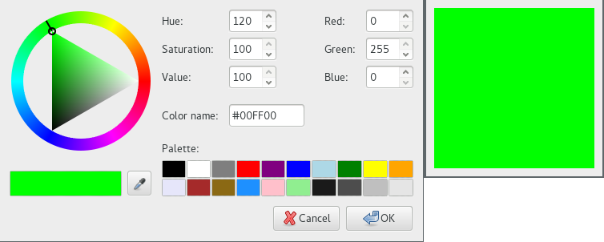

  GTK+ 2.0 Tutorial using Ocaml
  ------------------------------- ----------------------- ---------------------------
  [\<\<\< Previous](x1307.html)   Miscellaneous Widgets   [Next \>\>\>](x1415.html)

* * * * *

Color Selection {.SECT1}
===============

The color selection widget is, not surprisingly, a widget for
interactive selection of colors. This composite widget lets the user
select a color by manipulating RGB (Red, Green, Blue) and HSV (Hue,
Saturation, Value) triples. This is done either by adjusting single
values with sliders or entries, or by picking the desired color from a
hue-saturation wheel/value bar. Optionally, the opacity of the color can
also be set.

Lets have a look at what the color selection widget has to offer us. The
widget comes in two flavours:
[`GMisc.color_selection`{.LITERAL}](http://lablgtk.forge.ocamlcore.org/refdoc/GMisc.html#VALcolor_selection)
and
[`GWindow.color_selection_dialog`{.LITERAL}](http://lablgtk.forge.ocamlcore.org/refdoc/GWindow.html#VALcolor_selection_dialog).

~~~~ {.PROGRAMLISTING}
val GMisc.color_selection :
    ?alpha:int ->
    ?color:Gdk.color ->
    ?has_opacity_control:bool ->
    ?has_palette:bool ->
    ?border_width:int ->
    ?width:int ->
    ?height:int ->
    ?packing:(GObj.widget -> unit) ->
    ?show:bool -> unit -> color_selection
~~~~

You'll probably not be using this constructor directly. It creates an
orphan color\_selection widget which you'll have to parent yourself. The
color\_selection widget inherits from the VBox widget.

~~~~ {.PROGRAMLISTING}
val GWindow.color_selection_dialog :
    ?title:string ->
    ?parent:#window_skel ->
    ?destroy_with_parent:bool ->
    ?allow_grow:bool ->
    ?allow_shrink:bool ->
    ?icon:GdkPixbuf.pixbuf ->
    ?modal:bool ->
    ?screen:Gdk.screen ->
    ?type_hint:Gdk.Tags.window_type_hint ->
    ?position:Gtk.Tags.window_position ->
    ?wm_name:string ->
    ?wm_class:string ->
    ?border_width:int ->
    ?width:int ->
    ?height:int ->
    ?show:bool -> unit -> color_selection_dialog
~~~~

This is the most common color selection constructor. It creates a
color\_selection\_dialog. It consists of a Frame containing a
color\_selection widget, an HSeparator and an HBox with three buttons,
"Ok", "Cancel" and "Help". You can reach these buttons by accessing the
"ok\_button", "cancel\_button" and "help\_button" methods in the
color\_selection\_dialog object, (i.e.,
`color_sel_dialog#ok_button`{.LITERAL}).

~~~~ {.PROGRAMLISTING}
method set_has_opacity_control : bool -> unit
~~~~

The color selection widget supports adjusting the opacity of a color
(also known as the alpha channel). This is disabled by default. Calling
this function with has\_opacity set to true enables opacity. Likewise,
has\_opacity set to false will disable opacity.

~~~~ {.PROGRAMLISTING}
method set_color : Gdk.color -> unit
method set_alpha : int -> unit
~~~~

You can set the current color explicitly by calling set\_color method
with a GdkColor. Setting the opacity (alpha channel) is done with
set\_alpha method. The alpha value should be between 0 (fully
transparent) and 65636 (fully opaque).

~~~~ {.PROGRAMLISTING}
method color : Gdk.color
method alpha : int
~~~~

Here's a simple example demonstrating the use of the
color\_selection\_dialog. The program displays a window containing a
drawing area. Clicking on it opens a color selection dialog, and
changing the color in the color selection dialog changes the background
color.

~~~~ {.PROGRAMLISTING}
(* file: colorsel.ml *)

let dialog_ref = ref None
let color = ref (`RGB (0, 65535, 0))     (* GDraw.color ref type *)

(* "color_changed" event does not exist in lablgtk2!!! *)
(*
let color_changed_cb colorsel drawingarea () =
  let ncolor = colorsel#color in
  drawingarea#misc#modify_bg [(`NORMAL, `COLOR ncolor)]
*)

let response dlg drawingarea resp =
  let colorsel = dlg#colorsel in
  begin
  match resp with
  | `OK -> color := `COLOR colorsel#color
  | _ -> ()
  end;
  drawingarea#misc#modify_bg [(`NORMAL, !color)];
  dlg#misc#hide ()

(* Drawingarea button_press event handler *)
let button_pressed drawingarea ev =
  (* Create color selection dialog *)
  let colordlg =
    match !dialog_ref with
    | None ->
      let dlg = GWindow.color_selection_dialog ~title:"Select background color" () in
      dialog_ref := Some dlg;
      dlg
    | Some dlg -> dlg
  in

  (* Get the ColorSelection widget *)
  let colorsel = colordlg#colorsel in

  (* set_prev_color does not exist in lablgtk2!!! *)
  (* colorsel#set_prev_color (GDraw.color !color); *)
  colorsel#set_color (GDraw.color !color); (* requires Gdk.color type *)
  colorsel#set_has_palette true;

  (* Connect to the "color_changed" signal *)
  (* This event does not exist in lablgtk2!!! *)
  (* Need confirm to lablgtk2 team. *)
  (* colorsel#connect#color_changed ~callback:(color_changed_cb colorsel drawingarea);
  *)

  colordlg#connect#response ~callback:(response colordlg drawingarea);

  (* Show the dialog *)
  colordlg#run ();
  true
    
let main () =
  (* Create toplevel window, set title and policies (allow_grow, allow_shrink) *)
  let window = GWindow.window ~title:"Color selection test" ~border_width:10
    ~allow_grow:true ~allow_shrink:true () in

  (* Attach "destroy" events so we can exit *)
  window#connect#destroy ~callback:GMain.Main.quit;

  (* Create drawingarea, set size and catch button events *)
  let drawingarea = GMisc.drawing_area ~width:200 ~height:200 ~packing:window#add () in
  drawingarea#misc#modify_bg [(`NORMAL, !color)];
  drawingarea#event#add [`BUTTON_PRESS];
  drawingarea#event#connect#button_press ~callback:(button_pressed drawingarea);

  window#show ();
  GMain.Main.main ()

let _ = Printexc.print main ()
~~~~

* * * * *

  ------------------------------- -------------------- ---------------------------
  [\<\<\< Previous](x1307.html)   [Home](book1.html)   [Next \>\>\>](x1415.html)
  Calendar                        [Up](c953.html)      File Selections
  ------------------------------- -------------------- ---------------------------

