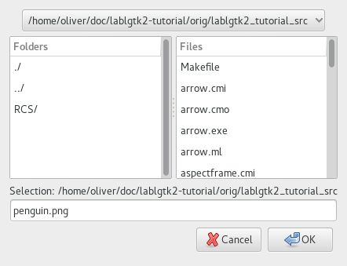

  GTK+ 2.0 Tutorial using Ocaml
  ------------------------------- ----------------------- ---------------------------
  [\<\<\< Previous](x1390.html)   Miscellaneous Widgets   [Next \>\>\>](c1436.html)

* * * * *

File Selections {.SECT1}
===============

The file selection widget is a quick and simple way to display a File
dialog box. It comes complete with Ok, Cancel, and Help buttons, a great
way to cut down on programming time.

To create a new file selection box use
[`GWindow.file_selection`{.LITERAL}](http://lablgtk.forge.ocamlcore.org/refdoc/GWindow.html#VALfile_selection):

~~~~ {.PROGRAMLISTING}
val GWindow.file_selection :
    ?title:string ->
    ?show_fileops:bool ->
    ?filename:string ->
    ?select_multiple:bool ->
    ?parent:#window_skel ->
    ?destroy_with_parent:bool ->
    ?allow_grow:bool ->
    ?allow_shrink:bool ->
    ?icon:GdkPixbuf.pixbuf ->
    ?modal:bool ->
    ?resizable:bool ->
    ?screen:Gdk.screen ->
    ?type_hint:Gdk.Tags.window_type_hint ->
    ?position:Gtk.Tags.window_position ->
    ?wm_name:string ->
    ?wm_class:string ->
    ?border_width:int ->
    ?width:int ->
    ?height:int ->
    ?show:bool -> unit -> file_selection
~~~~

To set the filename, for example to bring up a specific directory, or
give a default filename, use `filename`{.LITERAL} argument or this
function:

~~~~ {.PROGRAMLISTING}
method set_filename : string -> unit
~~~~

To grab the text that the user has entered or clicked on, use this
function:

~~~~ {.PROGRAMLISTING}
method filename : string
~~~~

There are also pointers to the widgets contained within the file
selection widget. These are:

~~~~ {.PROGRAMLISTING}
method dir_list : string GList.clist
method file_list : string GList.clist
method get_selections : string list
method ok_button : GButton.button
method cancel_button : GButton.button
method help_button : GButton.button
~~~~

Most likely you will want to use the ok\_button, cancel\_button, and
help\_button methods in signaling their use.

Included example is nothing much to creating a file selection widget.
While in this example the Help button appears on the screen, it does
nothing as there is not a signal attached to it.

~~~~ {.PROGRAMLISTING}
(* file: filesel.ml *)

(* Get the selected filename and print it to the console *)
let file_ok_sel filew () =
  print_endline filew#filename;
  flush stdout

let main () =
  (* Create a new file selection widget; set default filename *)
  let filew = GWindow.file_selection ~title:"File selection" ~border_width:10
    ~filename:"penguin.png" () in

  (* Set a handler for destroy event that immediately exits GTK. *)
  filew#connect#destroy ~callback:GMain.Main.quit;

  (* Connect the ok_button to file_ok_sel function *)
  filew#ok_button#connect#clicked ~callback:(file_ok_sel filew);

  (* Connect the cancel_button to destroy the widget *)
  filew#cancel_button#connect#clicked ~callback:filew#destroy;

  filew#show ();
  (* Rest in main and wait for the fun to begin! *)
  GMain.Main.main ()

let _ = Printexc.print main ()
~~~~

* * * * *

  ------------------------------- -------------------- ---------------------------
  [\<\<\< Previous](x1390.html)   [Home](book1.html)   [Next \>\>\>](c1436.html)
  Color Selection                 [Up](c953.html)      Container Widgets
  ------------------------------- -------------------- ---------------------------

