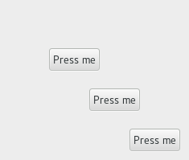

  GTK+ 2.0 Tutorial using Ocaml
  ------------------------------- ------------------- ---------------------------
  [\<\<\< Previous](x1455.html)   Container Widgets   [Next \>\>\>](x1496.html)

* * * * *

Fixed Container {.SECT1}
===============

The Fixed container allows you to place widgets at a fixed position
within it's window, relative to it's upper left hand corner. The
position of the widgets can be changed dynamically.

[`GPack.fixed`{.LITERAL}](http://lablgtk.forge.ocamlcore.org/refdoc/GPack.html#VALfixed)
is the function associated with the fixed widget:

~~~~ {.PROGRAMLISTING}
val GPack.fixed :
    ?has_window:bool ->
    ?border_width:int ->
    ?width:int ->
    ?height:int ->
    ?packing:(GObj.widget -> unit) ->
    ?show:bool -> unit -> fixed

method put : GObj.widget -> x:int -> y:int -> unit
method move : GObj.widget -> x:int -> y:int -> unit
~~~~

The function GPack.fixed allows you to create a new Fixed container.

put method places `widget`{.LITERAL} in the container `fixed`{.LITERAL}
at the position specified by `x`{.LITERAL} and `y`{.LITERAL}.

move method allows the specified widget to be moved to a new position.

~~~~ {.PROGRAMLISTING}
method set_has_window : bool -> unit
method has_window : bool
~~~~

Normally, Fixed widgets don't have their own X window. Since this is
different from the behaviour of Fixed widgets in earlier releases of
GTK, the set\_has\_window method allows the creation of Fixed widgets
*with* their own window. It has to be called before realizing the
widget.

The following example illustrates how to use the Fixed Container.

~~~~ {.PROGRAMLISTING}
(* file: fixed.ml *)

(* Global variables to store the position of the widget
 * within the fixed container *)
let rx = ref 50
let ry = ref 50

(* This callback function moves the button to a new position
 * in the Fixed container. *)
let move_button but fixed () =
  rx := (!rx + 30) mod 300;
  ry := (!ry + 50) mod 300;
  fixed#move but#coerce ~x:!rx ~y:!ry

let main () =
  (* Create a new window; set title and border width *)
  let window = GWindow.window ~title:"Fixed Container" ~border_width:10 () in

  (* Here we connect the "destroy" event to a signal handler *)
  window#connect#destroy ~callback:GMain.Main.quit;

  (* Create a Fixed Container *)
  let fixed = GPack.fixed ~packing:window#add () in

  for i = 1 to 3 do
    (* Creates a new button with the label "Press me"
     * and packs the button into the fixed containers window. *)
    let button = GButton.button ~label:"Press me"
      ~packing:(fixed#put ~x:(i*50) ~y:(i*50)) ()
    in

    (* When the button receives the "clicked" signal, it will call the
     * function move_button passing it the Fixed Container as its
     * argument. *)
    button#connect#clicked ~callback:(move_button button fixed)
  done;

  (* Display the window and enter the event loop *)
  window#show ();
  GMain.Main.main ()

let _ = Printexc.print main ()
~~~~

* * * * *

  ------------------------------- -------------------- ---------------------------
  [\<\<\< Previous](x1455.html)   [Home](book1.html)   [Next \>\>\>](x1496.html)
  The Alignment widget            [Up](c1436.html)     Layout Container
  ------------------------------- -------------------- ---------------------------

