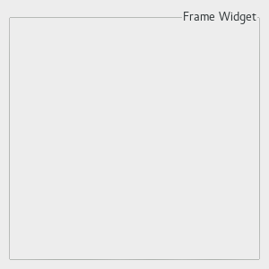

  GTK+ 2.0 Tutorial using Ocaml
  ------------------------------- ------------------- ---------------------------
  [\<\<\< Previous](x1496.html)   Container Widgets   [Next \>\>\>](x1538.html)

* * * * *

Frames {.SECT1}
======

Frames can be used to enclose one or a group of widgets with a box which
can optionally be labelled. The position of the label and the style of
the box can be altered to suit.

A Frame can be created with the function
[`GBin.frame`{.LITERAL}](http://lablgtk.forge.ocamlcore.org/refdoc/GBin.html#VALframe)
:

~~~~ {.PROGRAMLISTING}
val frame :
    ?label:string ->
    ?label_xalign:Gtk.clampf ->
    ?label_yalign:Gtk.clampf ->
    ?shadow_type:Gtk.Tags.shadow_type ->
    ?border_width:int ->
    ?width:int ->
    ?height:int ->
    ?packing:(GObj.widget -> unit) ->
    ?show:bool -> unit -> frame
~~~~

The label is by default placed in the upper left hand corner of the
frame. A value of NULL for the `label`{.LITERAL} argument will result in
no label being displayed. The text of the label can be changed using the
next function.

~~~~ {.PROGRAMLISTING}
method set_label : string option -> unit
~~~~

The position of the label can be changed using these functions:

~~~~ {.PROGRAMLISTING}
method set_label_xalign : float -> unit
method set_label_yalign : float -> unit
~~~~

`xalign`{.LITERAL} and `yalign`{.LITERAL} take values between 0.0 and
1.0. `xalign`{.LITERAL} indicates the position of the label along the
top horizontal of the frame. `yalign`{.LITERAL} is not currently used.
The default value of xalign is 0.0 which places the label at the left
hand end of the frame.

The next function alters the style of the box that is used to outline
the frame.

~~~~ {.PROGRAMLISTING}
method set_shadow_type : Gtk.Tags.shadow_type -> unit
~~~~

The `type`{.LITERAL} argument can take one of the following values:

~~~~ {.PROGRAMLISTING}
  `NONE
  `IN
  `OUT
  `ETCHED_IN (the default)
  `ETCHED_OUT
~~~~

The following code example illustrates the use of the Frame widget.

~~~~ {.PROGRAMLISTING}
(* file: frame.ml *)

let main () =
  (* Create a new window; set title and border width *)
  let window = GWindow.window ~title:"Frame Example" ~width:300 ~height:300 ~border_width:10 () in

  (* Here we connect the "destroy" event to a signal handler *)
  window#connect#destroy ~callback:GMain.Main.quit;

  (* Create a Frame
   * Set the frame's label
   * Align the label at the right of the frame
   * Set the style of the frame *)
  let frame = GBin.frame ~label:"Frame Widget" ~label_xalign:1.0 ~shadow_type:`ETCHED_OUT ~packing:window#add () in

  window#show ();
  GMain.Main.main ()

let _ = Printexc.print main ()
~~~~

* * * * *

  ------------------------------- -------------------- ---------------------------
  [\<\<\< Previous](x1496.html)   [Home](book1.html)   [Next \>\>\>](x1538.html)
  Layout Container                [Up](c1436.html)     Aspect Frames
  ------------------------------- -------------------- ---------------------------

