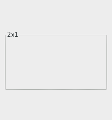

  GTK+ 2.0 Tutorial using Ocaml
  ------------------------------- ------------------- ---------------------------
  [\<\<\< Previous](x1510.html)   Container Widgets   [Next \>\>\>](x1558.html)

* * * * *

Aspect Frames {.SECT1}
=============

The aspect frame widget is like a frame widget, except that it also
enforces the aspect ratio (that is, the ratio of the width to the
height) of the child widget to have a certain value, adding extra space
if necessary. This is useful, for instance, if you want to preview a
larger image. The size of the preview should vary when the user resizes
the window, but the aspect ratio needs to always match the original
image.

To create a new aspect frame use
[`GBin.aspect_frame`{.LITERAL}](http://lablgtk.forge.ocamlcore.org/refdoc/GBin.html#VALaspect_frame):

~~~~ {.PROGRAMLISTING}
val GBin.aspect_frame :
    ?obey_child:bool ->
    ?ratio:float ->
    ?xalign:Gtk.clampf ->
    ?yalign:Gtk.clampf ->
    ?label:string ->
    ?label_xalign:Gtk.clampf ->
    ?label_yalign:Gtk.clampf ->
    ?shadow_type:Gtk.Tags.shadow_type ->
    ?border_width:int ->
    ?width:int ->
    ?height:int ->
    ?packing:(GObj.widget -> unit) ->
    ?show:bool -> unit -> aspect_frame
~~~~

`xalign`{.LITERAL} and `yalign`{.LITERAL} specify alignment as with
Alignment widgets. If `obey_child`{.LITERAL} is true, the aspect ratio
of a child widget will match the aspect ratio of the ideal size it
requests. Otherwise, it is given by `ratio`{.LITERAL}.

To change the options of an existing aspect frame, you can use:

~~~~ {.PROGRAMLISTING}
method set_xalign : float -> unit
method set_yalign : float -> unit
method set_ratio : float -> unit
method set_obey_child : bool -> unit
~~~~

As an example, the following program uses an AspectFrame to present a
drawing area whose aspect ratio will always be 2:1, no matter how the
user resizes the top-level window.

~~~~ {.PROGRAMLISTING}
(* file: aspectframe.ml *)

let main () =
  (* Create a new window; set title and border width *)
  let window = GWindow.window ~title:"Aspect Frame" ~border_width:10 () in

  (* Here we connect the "destroy" event to a signal handler *)
  window#connect#destroy ~callback:GMain.Main.quit;

  (* Create a Frame
   * Set the frame's label
   * Align the label at the right of the frame
   * Set the style of the frame *)
  let aspect_frame = GBin.aspect_frame ~label:"2x1"
    ~xalign:0.5 (* center x *)
    ~yalign:0.5 (* center y *)
    ~ratio:2.0  (* xsize/ysize = 2.0 *)
    ~obey_child:false (* ignore child's aspect *)
    ~packing:window#add () in

  (* Now add a child widget to the aspect frame *)
  (* Ask for a 200x200 widnow, but the AspectFrame will give us a 200x100
   * window since we are forcing a 2x1 aspect ratio *)
  let drawing_area = GMisc.drawing_area ~width:200 ~height:200 ~packing:aspect_frame#add () in

  window#show ();
  GMain.Main.main ()

let _ = Printexc.print main ()
~~~~

* * * * *

  ------------------------------- -------------------- ---------------------------
  [\<\<\< Previous](x1510.html)   [Home](book1.html)   [Next \>\>\>](x1558.html)
  Frames                          [Up](c1436.html)     Paned Window Widgets
  ------------------------------- -------------------- ---------------------------

