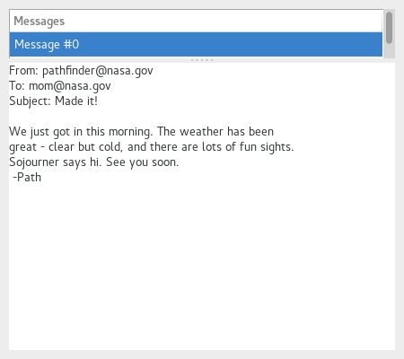

  GTK+ 2.0 Tutorial using Ocaml
  ------------------------------- ------------------- ---------------------------
  [\<\<\< Previous](x1538.html)   Container Widgets   [Next \>\>\>](x1577.html)

* * * * *

Paned Window Widgets {.SECT1}
====================

The paned window widgets are useful when you want to divide an area into
two parts, with the relative size of the two parts controlled by the
user. A groove is drawn between the two portions with a handle that the
user can drag to change the ratio. The division can either be horizontal
(\`HORIZONTAL) or vertical (\`VERTICAL).

To create a new paned window, call
[`GPack.paned`{.LITERAL}](http://lablgtk.forge.ocamlcore.org/refdoc/GPack.html#VALpaned)
with orientation(\`HORIZONTAL or \`VERTICAL):

~~~~ {.PROGRAMLISTING}
val GPack.paned :
    Gtk.Tags.orientation ->
    ?border_width:int ->
    ?width:int ->
    ?height:int ->
    ?packing:(GObj.widget -> unit) ->
    ?show:bool -> unit -> paned
~~~~

After creating the paned window widget, you need to add child widgets to
its two halves. To do this, use the functions:

~~~~ {.PROGRAMLISTING}
method add1 : GObj.widget -> unit
method add2 : GObj.widget -> unit
~~~~

`add1`{.LITERAL} method adds the child widget to the left or top half of
the paned window. `add2`{.LITERAL} method adds the child widget to the
right or bottom half of the paned window.

As an example, we will create part of the user interface of an imaginary
email program. A window is divided into two portions vertically, with
the top portion being a list of email messages and the bottom portion
the text of the email message. Most of the program is pretty
straightforward. A couple of points to note: text can't be added to a
Text widget until it is realized. This could be done by calling
\#misc\#realize method, but as a demonstration of an alternate
technique, we connect a handler to the "realize" signal to add the text.
Also, we need to add the `GTK_SHRINK`{.LITERAL} option to some of the
items in the table containing the text window and its scrollbars, so
that when the bottom portion is made smaller, the correct portions
shrink instead of being pushed off the bottom of the window.

~~~~ {.PROGRAMLISTING}
(* file: paned.ml *)

let cols = new GTree.column_list
let str_col = cols#add Gobject.Data.string

(* Create the list of "messages" *)
let create_list () =
  (* Create a new scrolled window, with scrollbars only if needed *)
  let scrolled_window = GBin.scrolled_window
    ~hpolicy:`AUTOMATIC ~vpolicy:`AUTOMATIC () in

  let model = GTree.list_store cols in
  let treeview = GTree.view ~model ~packing:(scrolled_window#add_with_viewport) () in

  for i = 0 to 10 do
    let iter = model#append () in
    model#set ~row:iter ~column:str_col (Printf.sprintf "Message #%d" i)
  done;
  let renderer = GTree.cell_renderer_text [] in
  let column = GTree.view_column ~title:"Messages"
    ~renderer:(renderer, ["text", str_col]) () in
  treeview#append_column column;
  scrolled_window#coerce

(* Add some text to our text widget - this is a callback that is invoked
 * when our window is realized. We could also force our window to be
 * realized with #misc#realize, but it would have to be part of
 * a hierarchy first *)
let insert_text (buffer: GText.buffer) =
  let iter = buffer#get_iter `START in
  buffer#insert ~iter (
    "From: pathfinder@nasa.gov\n" ^
    "To: mom@nasa.gov\n" ^
    "Subject: Made it!\n" ^
    "\n" ^
    "We just got in this morning. The weather has been\n" ^
    "great - clear but cold, and there are lots of fun sights.\n" ^
    "Sojourner says hi. See you soon.\n" ^
    " -Path\n")

(* Create a scrolled text area that displays a "message" *)
let create_text () =
  let scrolled_window = GBin.scrolled_window
    ~hpolicy:`AUTOMATIC ~vpolicy:`AUTOMATIC () in
  let view = GText.view ~packing:scrolled_window#add () in
  let buffer = view#buffer in
  insert_text buffer;
  scrolled_window#coerce

let main () =
  (* Create a new window; set title and border width *)
  let window = GWindow.window ~title:"Paned Windows" ~border_width:10
    ~width:450 ~height:400 () in

  (* Set a handler for destroy event that immediately exits GTK. *)
  window#connect#destroy ~callback:GMain.Main.quit;

  (* create a vpaned widget and add it to our toplevel window *)
  let vpaned = GPack.paned `VERTICAL ~packing:window#add () in

  (* Now create the contents of the two halves of the window *)
  let list = create_list () in
  vpaned#add1 list;

  let text = create_text () in
  vpaned#add2 text;

  window#show ();
  GMain.Main.main ()

let _ = Printexc.print main ()
~~~~

* * * * *

  ------------------------------- -------------------- ---------------------------
  [\<\<\< Previous](x1538.html)   [Home](book1.html)   [Next \>\>\>](x1577.html)
  Aspect Frames                   [Up](c1436.html)     Viewports
  ------------------------------- -------------------- ---------------------------

