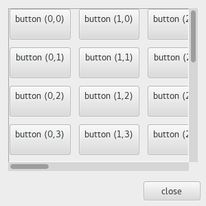

  GTK+ 2.0 Tutorial using Ocaml
  ------------------------------- ------------------- ---------------------------
  [\<\<\< Previous](x1577.html)   Container Widgets   [Next \>\>\>](x1623.html)

* * * * *

Scrolled Windows {.SECT1}
================

Scrolled windows are used to create a scrollable area with another
widget inside it. You may insert any type of widget into a scrolled
window, and it will be accessible regardless of the size by using the
scrollbars.

The function
[`GBin.scrolled_window`{.LITERAL}](http://lablgtk.forge.ocamlcore.org/refdoc/GBin.html#VALscrolled_window)
is used to create a new scrolled window.

~~~~ {.PROGRAMLISTING}
val GBin.scrolled_window :
    ?hadjustment:GData.adjustment ->
    ?vadjustment:GData.adjustment ->
    ?hpolicy:Gtk.Tags.policy_type ->
    ?vpolicy:Gtk.Tags.policy_type ->
    ?placement:Gtk.Tags.corner_type ->
    ?shadow_type:Gtk.Tags.shadow_type ->
    ?border_width:int ->
    ?width:int ->
    ?height:int ->
    ?packing:(GObj.widget -> unit) ->
    ?show:bool -> unit -> scrolled_window
~~~~

Where the argument `hadjustment`{.LITERAL} is the adjustment for the
horizontal direction, and `vadjustment`{.LITERAL}, the adjustment for
the vertical direction. These are almost always not given.

~~~~ {.PROGRAMLISTING}
method set_hpolicy : Gtk.Tags.policy_type -> unit
method set_vpolicy : Gtk.Tags.policy_type -> unit
~~~~

This sets the policy to be used with respect to the scrollbars. The
`set_hpolicy`{.LITERAL} sets the policy for the horizontal scrollbar,
and the `set_vpolicy`{.LITERAL} for the vertical scrollbar.

The policy may be one of `` `AUTOMATIC ``{.LITERAL} or
`` `ALWAYS ``{.LITERAL}. `` `AUTOMATIC ``{.LITERAL} will automatically
decide whether you need scrollbars, whereas `` `ALWAYS ``{.LITERAL} will
always leave the scrollbars there.

You can then place your object into the scrolled window using the
following function.

~~~~ {.PROGRAMLISTING}
method add_with_viewport : GObj.widget -> unit
~~~~

Here is a simple example that packs a table with 100 toggle buttons into
a scrolled window. I've only commented on the parts that may be new to
you.

~~~~ {.PROGRAMLISTING}
(* file: scrolledwin.ml *)

let main () =
  (* Create a new dialog window for the scrolled window to be
   * packed into. *)
  let window = GWindow.dialog ~title:"ScrolledWindow example" ~width:300 ~height:300 ~border_width:0 () in
  window#connect#destroy ~callback:GMain.Main.quit;

  (* Create a new scrolled window *)
  let scrolled_window = GBin.scrolled_window ~border_width:10
    ~hpolicy:`AUTOMATIC ~vpolicy:`AUTOMATIC ~packing:window#vbox#add () in

  (* Create a table of 10 by 10 squares.
   * Set the spacing to 10 on x and 10 on y *)
  let table = GPack.table ~rows:10 ~columns:10 ~row_spacings:10 ~col_spacings:10
    ~packing:scrolled_window#add_with_viewport () in

  for i = 0 to 10 do
    for j=0 to 10 do
      GButton.toggle_button
        ~label:("button ("^ string_of_int i ^","^ string_of_int j ^")\n")
        ~packing:(table#attach ~left:i ~top:j ~expand:`BOTH) ()
    done
  done;

  (* Add a "close" button to the bottom of the dialog *)
  let button = GButton.button ~label:"close" ~packing:window#action_area#add () in
  button#connect#clicked ~callback:(window#destroy);

  (* This grabs this button to be the default button. Simply hitting
   * the "Enter" key will cause this button to activate. *)
  button#grab_default ();

  window#show ();
  GMain.Main.main ()

let _ = Printexc.print main ()
~~~~

Try playing with resizing the window. You'll notice how the scrollbars
react. You may also wish to use the \#misc\#set\_size\_request method
call to set the default size of the window or other widgets.

* * * * *

  ------------------------------- -------------------- ---------------------------
  [\<\<\< Previous](x1577.html)   [Home](book1.html)   [Next \>\>\>](x1623.html)
  Viewports                       [Up](c1436.html)     Button Boxes
  ------------------------------- -------------------- ---------------------------

