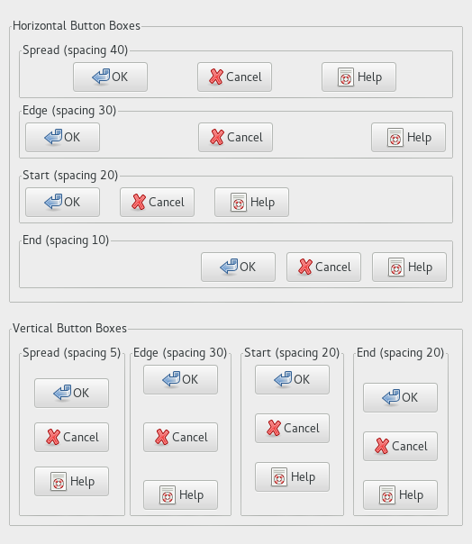

  GTK+ 2.0 Tutorial using Ocaml
  ------------------------------- ------------------- ---------------------------
  [\<\<\< Previous](x1595.html)   Container Widgets   [Next \>\>\>](x1637.html)

* * * * *

Button Boxes {.SECT1}
============

Button Boxes are a convenient way to quickly layout a group of buttons.
They come in both horizontal and vertical flavours. You create a new
Button Box with the following function
[`GPack.button_box`{.LITERAL}](http://lablgtk.forge.ocamlcore.org/refdoc/GPack.html#VALbutton_box)
, which create a horizontal or vertical box according to the given
argument ;\`HORIZONTAL or \`VERTICAL:

~~~~ {.PROGRAMLISTING}
val GPack.button_box :
    Gtk.Tags.orientation ->
    ?spacing:int ->
    ?child_width:int ->
    ?child_height:int ->
    ?child_ipadx:int ->
    ?child_ipady:int ->
    ?layout:GtkPack.BBox.bbox_style ->
    ?border_width:int ->
    ?width:int ->
    ?height:int ->
    ?packing:(GObj.widget -> unit) ->
    ?show:bool -> unit -> button_box
~~~~

Buttons are added to a Button Box using the usual function:

~~~~ {.PROGRAMLISTING}
method add : GObj.widget -> unit
~~~~

Here's an example that illustrates all the different layout settings for
Button Boxes.

~~~~ {.PROGRAMLISTING}
(* file: buttonbox.ml *)

(* Create a Buttn Box with the specified parameters *)
let create_bbox direction title spacing child_width child_height layout =
  let frame = GBin.frame ~label:title () in
  let bbox = GPack.button_box direction ~border_width:5 ~layout
    ~child_height ~child_width ~spacing ~packing:frame#add () in
  GButton.button ~stock:`OK ~packing:bbox#add ();
  GButton.button ~stock:`CANCEL ~packing:bbox#add ();
  GButton.button ~stock:`HELP ~packing:bbox#add ();
  frame#coerce

let main () =
  let window = GWindow.window ~title:"Button Boxes" ~border_width:10 () in
  window #connect#destroy ~callback:GMain.Main.quit;

  let main_vbox = GPack.vbox ~packing:window#add () in

  let frame_horz = GBin.frame ~label:"Horizontal Button Boxes"
    ~packing:(main_vbox#pack ~expand:true ~fill:true ~padding:10) () in
  
  let vbox = GPack.vbox ~border_width:10 ~packing:frame_horz#add () in
  
  vbox#add (create_bbox `HORIZONTAL "Spread (spacing 40)" 40 85 20 `SPREAD);
  vbox#pack (create_bbox `HORIZONTAL "Edge (spacing 30)" 30 85 20 `EDGE) 
    ~expand:true ~fill:true ~padding:5;
  vbox#pack (create_bbox `HORIZONTAL "Start (spacing 20)" 20 85 20 `START)
    ~expand:true ~fill:true ~padding:5;
  vbox#pack (create_bbox `HORIZONTAL "End (spacing 10)" 10 85 20 `END)
    ~expand:true ~fill:true ~padding:5;

  let frame_vert = GBin.frame ~label:"Vertical Button Boxes"
    ~packing:(main_vbox#pack ~expand:true ~fill:true ~padding:10) () in
  
  let hbox = GPack.hbox ~border_width:10 ~packing:frame_vert#add () in
  hbox#add (create_bbox `VERTICAL "Spread (spacing 5)" 5 85 20 `SPREAD);
  hbox#pack (create_bbox `VERTICAL "Edge (spacing 30)" 30 85 20 `EDGE)
    ~expand:true ~fill:true ~padding:5;
  hbox#pack (create_bbox `VERTICAL "Start (spacing 20)" 20 85 20 `START)
    ~expand:true ~fill:true ~padding:5;
  hbox#pack (create_bbox `VERTICAL "End (spacing 20)" 20 85 20 `END)
    ~expand:true ~fill:true ~padding:5;
  window#show ();

  (* Enter the event loop *)
  GMain.Main.main ()

let _ = Printexc.print main ()
~~~~

* * * * *

  ------------------------------- -------------------- ---------------------------
  [\<\<\< Previous](x1595.html)   [Home](book1.html)   [Next \>\>\>](x1637.html)
  Scrolled Windows                [Up](c1436.html)     Toolbar
  ------------------------------- -------------------- ---------------------------

