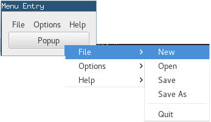

  GTK+ 2.0 Tutorial using Ocaml
  ------------------------------- ------------- ---------------------------
  [\<\<\< Previous](c1731.html)   Menu Widget   [Next \>\>\>](x1832.html)

* * * * *

Manual Menu Example {.SECT1}
===================

That should about do it. Let's take a look at an example to help
clarify.

~~~~ {.PROGRAMLISTING}
let uprint msg () =
  print_endline msg;
  flush stdout

let create_file_menu ~packing () =
  let file_menu = GMenu.menu ~packing () in
  let f (label, callback) =
    let item = GMenu.menu_item ~label ~packing:file_menu#append () in
    ignore (item#connect#activate ~callback)
  in
  List.iter f [("Open", uprint "Open"); ("Save", uprint "Save"); ("Quit", GMain.Main.quit)];
  file_menu

let button_pressed menu ev =
  let button = GdkEvent.Button.button ev in
  if button = 3
  then (
    menu#popup ~button ~time:(GdkEvent.Button.time ev);
    true
  ) else false

let main () =
  let window = GWindow.window ~title:"GMenu Demo" () in
  window#connect#destroy ~callback:GMain.Main.quit;
  let vbox = GPack.vbox ~packing:window#add () in
  let menu_bar = GMenu.menu_bar ~packing:vbox#add () in
  let file_item = GMenu.menu_item ~label:"File" ~packing:menu_bar#append () in
  let menu = create_file_menu ~packing:file_item#set_submenu () in
  let view = GText.view ~width:200 ~height:100 ~packing:vbox#add () in
  view#event#connect#button_press ~callback:(button_pressed menu);
  window#show ();
  GMain.Main.main ()

let _ = main ()
~~~~

You may also set a menu item to be insensitive and, using an accelerator
table, bind keys to menu functions.

* * * * *

  ------------------------------- -------------------- ---------------------------
  [\<\<\< Previous](c1731.html)   [Home](book1.html)   [Next \>\>\>](x1832.html)
  Menu Widget                     [Up](c1731.html)     Automatic Menu Generation
  ------------------------------- -------------------- ---------------------------

