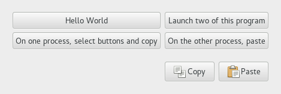

  GTK+ 2.0 Tutorial using Ocaml
  ------------------------------- ----------- ---------------------------
  [\<\<\< Previous](c1991.html)   Clipboard   [Next \>\>\>](c2013.html)

* * * * *

Clipboard Example {.SECT1}
=================

The following code is the program that copy and paste the buttons' state
from one application to the other.

Please launch two instance of the same program and select buttons and
click "Copy" button in one application. You can view that the button
state are changing to the same when you click "Paste" button in the
another instance of the program.

~~~~ {.PROGRAMLISTING}
(* file: clipboard.ml *)

(* Translate string to char list *)
let explode str =
  let len = String.length str in
  let rec loop clist i =
    if i >= len
    then List.rev clist
    else loop (str.[i] :: clist) (i+1)
  in
  loop [] 0

(* Put the status of the buttons to clipboard *)
let put_data buttons clipboard () =
  let append_active str but = if but#active then str ^ "1" else str ^ "0" in
  clipboard#set_text (List.fold_left append_active "" buttons)

(* Get the status of the buttons from clipboard and apply them *)
let get_data buttons clipboard () =
  match clipboard#text with
  | Some txt ->
      if String.length txt = 4 then (
        let to_bool c = if c = '1' then true else false in
        let active = List.map to_bool (explode txt) in
        let button_status = List.combine buttons active in
        List.iter (fun (but, b) -> but#set_active b) button_status
      ) else
        failwith "String length mismatch"
  | None -> ()

let main () =
  (* Create the toplevel window *)
  let window = GWindow.window ~title:"Clipboard Example" ~border_width:10 () in
  window#connect#destroy ~callback:GMain.Main.quit;

  let vbox = GPack.vbox ~packing:window#add () in
  let table = GPack.table ~columns:2 ~rows:2
    ~row_spacings:5 ~col_spacings:5 ~border_width:10 ~packing:vbox#add () in
  let make_button (left, top, label) =
    GButton.toggle_button ~label ~packing:(table#attach ~left ~top) ()
  in
  let buttons = List.map make_button [(0, 0, "Hello World");
    (1, 0, "Launch two of this program");
    (0, 1, "On one process, select buttons and copy");
    (1, 1, "On the other process, paste");] in

  (* Clipboard *)
  let clipboard = GData.clipboard Gdk.Atom.clipboard in

  let box = GPack.button_box `HORIZONTAL ~spacing:5 ~layout:`END
    ~border_width:10 ~packing:vbox#add () in

  (* "Copy" button *)
  let button = GButton.button ~stock:`COPY ~packing:box#add () in
  button#connect#clicked ~callback:(put_data buttons clipboard);

  (* "Paste" button *)
  let button = GButton.button ~stock:`PASTE ~packing:box#add () in
  button#connect#clicked ~callback:(get_data buttons clipboard);

  window#show ();
  GMain.Main.main ()

let _ = Printexc.print main ()
~~~~

* * * * *

  ------------------------------- -------------------- ---------------------------
  [\<\<\< Previous](c1991.html)   [Home](book1.html)   [Next \>\>\>](c2013.html)
  Clipboard                       [Up](c1991.html)     Drag-and-drop (DND)
  ------------------------------- -------------------- ---------------------------

