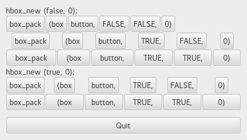
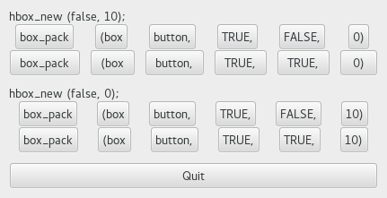

  GTK+ 2.0 Tutorial using Ocaml
  ------------------------------- ----------------- --------------------------
  [\<\<\< Previous](c383.html)    Packing Widgets   [Next \>\>\>](x456.html)

* * * * *

Details of Boxes {.SECT1}
================

Because of this flexibility, packing boxes in GTK can be confusing at
first. There are a lot of options, and it's not immediately obvious how
they all fit together. In the end, however, there are basically five
different styles.

Each line contains one horizontal box (hbox) with several buttons. The
call to
[`#pack`{.LITERAL}](http://lablgtk.forge.ocamlcore.org/refdoc/GPack.box_skel-c.html#METHODpack)
method is shorthand for the call to pack each of the buttons into the
hbox. Each of the buttons is packed into the hbox the same way.

This is the declaration of the
[`#pack`{.LITERAL}](http://lablgtk.forge.ocamlcore.org/refdoc/GPack.box_skel-c.html#METHODpack)
method.

~~~~ {.PROGRAMLISTING}
method pack :
    ?from:Gtk.Tags.pack_type ->
    ?expand:bool ->
    ?fill:bool ->
    ?padding:int ->
    GObj.widget -> unit

from : default value is `START
expand : default vaue is false
fill : default value is true, ignored if expand is false
~~~~

The first optional argument `from`{.LITERAL} can have
`` `START ``{.LITERAL} or `` `END ``{.LITERAL}. The
`` ~from:`START ``{.LITERAL} will start at the top and work its way down
in a vbox, and pack left to right in an hbox. The
`` ~from:`END ``{.LITERAL} will do the opposite, packing from bottom to
top in a vbox, and right to left in an hbox. Using `from`{.LITERAL}
option allows us to right justify or left justify our widgets and may be
mixed in any way to achieve the desired effect.

The `expand`{.LITERAL} argument controls whether the widgets are laid
out in the box to fill in all the extra space in the box so the box is
expanded to fill the area allotted to it (`true`{.LITERAL}); or the box
is shrunk to just fit the widgets (`false`{.LITERAL}). Setting expand to
`false`{.LITERAL} will allow you to do right and left justification of
your widgets. Otherwise, they will all expand to fit into the box.

The `fill`{.LITERAL} argument to the
[`#pack`{.LITERAL}](http://lablgtk.forge.ocamlcore.org/refdoc/GPack.box_skel-c.html#METHODpack)
method control whether the extra space is allocated to the objects
themselves (`true`{.LITERAL}), or as extra padding in the box around
these objects (`false`{.LITERAL}). It only has an effect if the
`expand`{.LITERAL} argument is also `true`{.LITERAL}.

The last argument is the object you are packing into the box. The
objects will all be buttons for now, so we'll be packing buttons into
boxes.

When creating a new box, the function looks like this
([`GPack.hbox ()`{.LITERAL}](http://lablgtk.forge.ocamlcore.org/refdoc/GPack.html#VALhbox)):

~~~~ {.PROGRAMLISTING}
GPack.hbox :
    ?homogeneous:bool ->
    ?spacing:int ->
    ?border_width:int ->
    ?width:int ->
    ?height:int ->
    ?packing:(GObj.widget -> unit) ->
    ?show:bool ->
    unit -> box

spacing: 0 by default
homogeneous: false by default
~~~~

The `homogeneous`{.LITERAL} argument to
[`GPack.hbox ()`{.LITERAL}](http://lablgtk.forge.ocamlcore.org/refdoc/GPack.html#VALhbox)
(and the same for
[`GPack.vbox ()`{.LITERAL}](http://lablgtk.forge.ocamlcore.org/refdoc/GPack.html#VALvbox))
controls whether each object in the box has the same size (i.e., the
same width in an hbox, or the same height in a vbox). If it is set, the
\#pack method essentially as if the `expand`{.LITERAL} argument was
always turned on.

What's the difference between `spacing`{.LITERAL} (set when the box is
created) and `padding`{.LITERAL} (set when elements are packed)?
`Spacing`{.LITERAL} is added between objects, and `padding`{.LITERAL} is
added on either side of an object. The following figure should make it
clearer:

Here is the code used to create the above images. I've commented it
fairly heavily so I hope you won't have any problems following it.
Compile it yourself and play with it.

* * * * *

  ------------------------------ -------------------- -------------------------------
  [\<\<\< Previous](c383.html)   [Home](book1.html)   [Next \>\>\>](x456.html)
  Packing Widgets                [Up](c383.html)      Packing Demonstration Program
  ------------------------------ -------------------- -------------------------------

