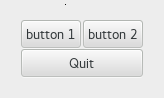

  GTK+ 2.0 Tutorial using Ocaml
  ------------------------------- ----------------- --------------------------
  [\<\<\< Previous](x459.html)    Packing Widgets   [Next \>\>\>](c518.html)

* * * * *

Table Packing Example {.SECT1}
=====================

Here we make a window with three buttons in a 2x2 table. The first two
buttons will be placed in the upper row. A third, quit button, is placed
in the lower row, spanning both columns. Which means it should look
something like this:

Here's the source code:

~~~~ {.PROGRAMLISTING}
(* file: table.ml *)

(* Our callback. *)
let hello msg () =
  Printf.printf "Hello again - %s was pressed\n" msg;
  flush stdout

let main () =
  (* Create a new window; set title and border width *)
  let window = GWindow.window ~title:"Table" ~border_width:20 () in

  (* Set a handler for destroy event that immediately exits GTK. *)
  window#connect#destroy ~callback:GMain.Main.quit;

  (* Create a 2x2 table and put it in the main window *)
  let table = GPack.table ~rows:2 ~columns:2 ~homogeneous:true
      ~packing:window#add () in

  (* Create first button *)
  let button = GButton.button ~label:"button 1" () in

  (* Insert button 1 into the upper left quadrant of the table *)
  table#attach ~left:0 ~top:0 (button#coerce);

  (* When the button is clicked, we call the "callback" function
   * with "button 1" as its argument *)
  button#connect#clicked ~callback:(hello "button 1");

  (* Create second button *)
  let button2 = GButton.button ~label:"button 2" () in

  (* Insert button 2 into the upper right quadrant of the table *)
  table#attach ~left:1 ~top:0 (button2#coerce);

  (* When the button is clicked, we call the "callback" function
   * with "button 2" as its argument *)
  button2#connect#clicked ~callback:(hello "button 2");

  (* Create "Quit" button *)
  let quit = GButton.button ~label:"Quit" () in

  (* Insert the quit button into the both
   * lower quadrants of the table *)
  table#attach ~left:0 ~right:2 ~top:1 (quit#coerce);

  (* When the "Quit" button is clicked, the program exits *)
  quit#connect#clicked ~callback:GMain.Main.quit;

  window#show ();
  GMain.Main.main ()

let _ = Printexc.print main ()
~~~~

* * * * *

  ------------------------------ -------------------- --------------------------
  [\<\<\< Previous](x459.html)   [Home](book1.html)   [Next \>\>\>](c518.html)
  Packing Using Tables           [Up](c383.html)      Widget Overview
  ------------------------------ -------------------- --------------------------

