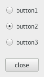

  GTK+ 2.0 Tutorial using Ocaml
  ------------------------------- ------------------- --------------------------
  [\<\<\< Previous](x733.html)    The Button Widget   [Next \>\>\>](c766.html)

* * * * *

Radio Buttons {.SECT1}
=============

Radio buttons are similar to check buttons except they are grouped so
that only one may be selected/depressed at a time. This is good for
places in your application where you need to select from a short list of
options.

Creating a new radio button is done with one of these calls; see
[`GButton.radio_button`{.LITERAL}](http://lablgtk.forge.ocamlcore.org/refdoc/GButton.html#VALradio_button):

~~~~ {.PROGRAMLISTING}
val GButton.radio_button :
    ?group:Gtk.radio_button Gtk.group ->
    ?label:string ->
    ?use_mnemonic:bool ->
    ?stock:GtkStock.id ->
    ?relief:Gtk.Tags.relief_style ->
    ?active:bool ->
    ?draw_indicator:bool ->
    ?packing:(GObj.widget -> unit) ->
    ?show:bool -> unit -> radio_button
~~~~

You'll notice the extra argument to these calls. They require a group to
perform their duty properly. The first call to radio\_button should not
pass the `~group`{.LITERAL} argument. Then create a group using:

~~~~ {.PROGRAMLISTING}
method group : Gtk.radio_button Gtk.group
~~~~

The important thing to remember is that `group`{.LITERAL} method must be
called for each new button added to the group. The result is then passed
into the next call to radio\_button. This allows a chain of buttons to
be established. The example below should make this clear.

You can shorten this slightly by using the following syntax, which
removes the need for a variable to hold the list of buttons:

~~~~ {.PROGRAMLISTING}
let button2 = GButton.radio_button ~label:"button2" ~group:button1#group () in
~~~~

It is also a good idea to explicitly set which button should be the
default depressed button with:

~~~~ {.PROGRAMLISTING}
method set_active : bool -> unit
~~~~

This is described in the section on toggle buttons, and works in exactly
the same way. Once the radio buttons are grouped together, only one of
the group may be active at a time. If the user clicks on one radio
button, and then on another, the first radio button will first emit a
"toggled" signal (to report becoming inactive), and then the second will
emit its "toggled" signal (to report becoming active).

The following example creates a radio button group with three buttons.

~~~~ {.PROGRAMLISTING}
(* file: radiobutton.ml *)

open GMain

let main () =
  let window = GWindow.window ~title:"radio buttons" ~border_width:0 () in
  window#connect#destroy ~callback:Main.quit;

  let box1 = GPack.vbox ~packing:window#add () in

  let box2 = GPack.vbox ~spacing:10 ~border_width:10 ~packing:box1#add () in

  let button1 = GButton.radio_button ~label:"button1" ~packing:box2#add () in

  let button2 = GButton.radio_button ~group:button1#group ~label:"button2"
      ~active:true ~packing:box2#add () in

  let button3 = GButton.radio_button
      ~group:button1#group ~label:"button3" ~packing:box2#add () in

  let separator = GMisc.separator `HORIZONTAL ~packing: box1#pack () in

  let box3 = GPack.vbox ~spacing:10 ~border_width:10 ~packing:box1#pack () in

  let button = GButton.button ~label:"close" ~packing:box3#add () in
  button#connect#clicked ~callback:Main.quit;
  button#grab_default ();

  window#show ();
  Main.main ()

let _ = main ()
~~~~

* * * * *

  ------------------------------ -------------------- --------------------------
  [\<\<\< Previous](x733.html)   [Home](book1.html)   [Next \>\>\>](c766.html)
  Check Buttons                  [Up](c669.html)      Adjustments
  ------------------------------ -------------------- --------------------------

